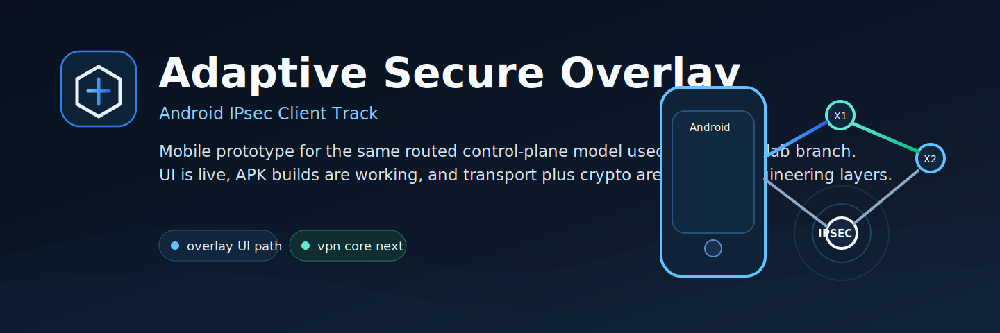

# Adaptive Secure Overlay IPsec Android



[](README.md)
[](README.ru.md)

Android client prototype for the Adaptive Secure Overlay IPsec research track.

Canonical repository name: `adaptive-ipsec-overlay-android`

This repository is the Android-facing branch of the project: it already mirrors the lab routing semantics and session flow, but it does not yet install a live VPN or IPsec data plane on Android.

## Current stage

This is a real Android prototype branch, not a finished mobile client.

- APK build is working
- Android UI/state-model base is working
- route selection and session-flow visualization are already present
- Rust `native-core` has been started for the first real crypto/session layer
- live transport, live crypto and live VPN/IPsec integration are not wired yet

See also: [STATUS.md](STATUS.md)

## Current scope

- Jetpack Compose Android client UI
- node selection for `A` and `B`
- `Random` or `Manual X1/X2` route mode
- research loop toggle for small-topology experiments
- session log visualizing:
  - management session bootstrap
  - inline privacy route setup
  - sealed locator delivery
  - ESP material preparation
  - direct ESP activation target

## Achieved so far

- Jetpack Compose client shell for the Android track
- overlay route semantics aligned with the lab model
- session log and research-flow visualization
- dedicated Rust crate for future Android crypto/core growth
- standalone APK build path for public repository use

## Current limitations

- overlay/session logic is still mocked at the client layer
- Rust core is not yet bound into Kotlin over JNI/FFI
- Android `VpnService`, real transport and real crypto are not wired yet

## Planned next layers

1. move session state into a background service
2. add config import and export
3. bind Rust `native-core` into the Android app
4. add real overlay transport
5. connect to Android `VpnService`

## Build

From the repository root:

```powershell
.\build-android-apk.ps1
```

Useful variants:

- `.\build-android-apk.ps1 -Release`
- `.\build-android-apk.ps1 -Offline`
- `.\build-android-apk.ps1 -VerboseLog`

On success the script prints the generated APK path from `app/build/outputs/apk/...`.

## Native core

- `native-core/` contains the first Rust crypto/core layer for Android.
- Current scope: session bootstrap model, X25519 shared secret derivation and HKDF-SHA256 key schedule.
- Current limitation: no JNI bridge is wired into the app yet.
